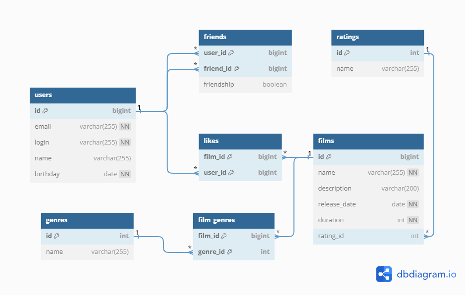

## java-filmorate

---

# Диаграмма базы данных

<br>

## Примеры запросов для основных операций

---

<details>
  <summary>Получить фильм с id=1</summary>

```sql
    SELECT *
    FROM films
    WHERE id = 1;
```

</details>  

<details>
  <summary>Удалить пользователя с id=1</summary>

```sql
    DELETE
    FROM users
    WHERE id = 1;
```

</details>

<details>
  <summary>Получить топ-10 фильмов по количеству лайков</summary>

```sql
    SELECT f.*,

    COUNT(l.user_id) AS count_likes

    FROM films AS f

    LEFT JOIN likes AS l ON f.id=l.film_id

    GROUP BY f.id

    ORDER BY count_likes DESC

    LIMIT 10;
```

</details>  

